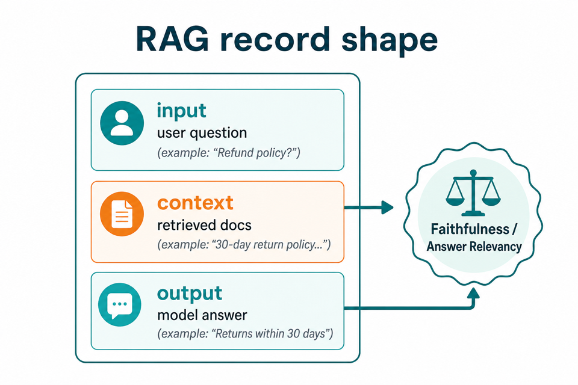

# qapitol-evals-kit

Local **BYOK** LLM and RAG evaluation metrics from [Qapitol](https://github.com/QapitolAI). Your data never leaves your machine — no Qapitol account, no trace upload.

**Version 0.2.0** · [Usage guide](docs/USAGE.md) · [JSONL & traces](docs/BATCH_AND_TRACES.md) · [CI gates](docs/CI.md)


---

## Who this is for

- ML / LLM engineers adding evals to notebooks, pipelines, or CI
- QA / eval leads who want coherence, relevance, RAG faithfulness, etc. without writing judges from scratch
- Teams with data-sovereignty rules (BYOK only; eval runs stay in your environment)

---

## What you can do

| Capability | How |
|------------|-----|
| Score a single response | Python API or `qapitol-evals run` CLI |
| Score many rows in Python | `evaluate_batch_sync` |
| Load traces from JSONL | `load_jsonl` → `run_metrics` → `write_results_jsonl` |
| Multi-turn agent sessions | `records_per_turn`, `record_final_turn`, `format_transcript` |
| RAG grounding checks | Pass `context` + use Faithfulness / Answer Relevancy |
| CI threshold gates | Code metrics or `MockCompletionClient` — no API key required |
| Code metrics (no API key) | `ExactMatchEvaluator`, `CustomAccuracyEvaluator` |
| LLM-as-judge (OpenAI / Anthropic) | `LLM(provider=...)` + 7 judge metrics |

> After `pip install`, detailed docs live on **GitHub** (PyPI **Documentation** link). The wheel ships code + CLI only.

---

## Install

**PyPI:**

```bash
pip install qapitol-evals-kit==0.2.0
pip install "qapitol-evals-kit[all]==0.2.0"   # OpenAI + Anthropic client libraries
```

**From source** (development):

```bash
pip install -e ".[dev,all]"
```

**From GitHub** (fallback):

```bash
pip install "qapitol-evals-kit @ git+https://github.com/QapitolAI/qapitol-evals-kit@v0.2.0"
pip install "qapitol-evals-kit @ git+https://github.com/QapitolAI/qapitol-evals-kit.git@main"
```

Verify: `qapitol-evals doctor`

Repo: [github.com/QapitolAI/qapitol-evals-kit](https://github.com/QapitolAI/qapitol-evals-kit) · Releases: [v0.2.0](https://github.com/QapitolAI/qapitol-evals-kit/releases/tag/v0.2.0) · PyPI: [qapitol-evals-kit](https://pypi.org/project/qapitol-evals-kit/)

---

## Quick starts

### Code metric (no API key)

```python
from qapitol.evals import ExactMatchEvaluator

score = ExactMatchEvaluator().evaluate({
    "output": "Paris",
    "expected": "Paris",
})
print(score.score, score.label)  # 1.0 match
```

### LLM judge (BYOK)

```bash
export OPENAI_API_KEY=sk-...
# or: export ANTHROPIC_API_KEY=...
```

```python
from qapitol.evals import CoherenceEvaluator
from qapitol.evals.llm import LLM

llm = LLM(provider="openai", model="gpt-4o-mini")
score = CoherenceEvaluator(llm).evaluate({
    "input": "What is RAG?",
    "output": "RAG retrieves context then generates an answer.",
})
print(score.score, score.label, score.explanation)
```

### RAG evaluation



```python
from qapitol.evals import FaithfulnessEvaluator
from qapitol.evals.llm import LLM

score = FaithfulnessEvaluator(LLM()).evaluate({
    "input": "Refund policy?",
    "output": "Returns accepted within 30 days.",
    "context": "Policy: 30-day return window for all items.",
})
```

### JSONL batch (100+ traces)


```python
from pathlib import Path

from qapitol.evals import CoherenceEvaluator, load_jsonl, run_metrics, summarize, write_results_jsonl
from qapitol.evals.llm import LLM

records = load_jsonl("traces.jsonl")
results = run_metrics(records, [CoherenceEvaluator(LLM())])

by_metric: dict[str, list] = {}
for row in results:
    for s in row["scores"]:
        by_metric.setdefault(s.name, []).append(s)
print(summarize(by_metric))

write_results_jsonl("results.jsonl", [(row, row["scores"]) for row in results])
```

Full schema and trace-mapping cookbook: [docs/BATCH_AND_TRACES.md](docs/BATCH_AND_TRACES.md).

### Multi-turn conversations


```python
from qapitol.evals import records_per_turn, record_final_turn, format_transcript

session = {
    "session_id": "s1",
    "messages": [
        {"role": "user", "content": "What is ML?"},
        {"role": "assistant", "content": "Machine learning learns from data."},
        {"role": "user", "content": "Give an example."},
        {"role": "assistant", "content": "Email spam filters use ML."},
    ],
}

per_turn = records_per_turn(session)       # Pattern A — judge each reply
final = record_final_turn(session)         # Pattern B — last reply only
transcript_input = format_transcript(session["messages"][:-1])  # Pattern C
```

### CI threshold gate (no API key)

```python
from qapitol.evals import ExactMatchEvaluator, load_jsonl, run_metrics, summarize

THRESHOLD = 0.9
results = run_metrics(load_jsonl("golden.jsonl"), [ExactMatchEvaluator()])

by_metric: dict[str, list] = {}
for row in results:
    for s in row["scores"]:
        by_metric.setdefault(s.name, []).append(s)
if summarize(by_metric).get("exact_match", 0) < THRESHOLD:
    raise SystemExit("FAIL: exact_match below threshold")
```

Mocked LLM judges for CI: [docs/CI.md](docs/CI.md).

---

## CLI

```bash
qapitol-evals doctor
qapitol-evals run --metric coherence --input "What is AI?" --output "AI is ..."
qapitol-evals run --metric faithfulness --output "30-day returns." --context "Policy: 30 days."
```

| Limit (v0.2) | Workaround |
|--------------|------------|
| One row per `run` command | JSONL batch via Python (`load_jsonl` + `run_metrics`) |
| Code metrics not in CLI | Python API or `examples/01_basic_code.py` |

---

## Metrics

| Type | Evaluators |
|------|------------|
| Code | `ExactMatchEvaluator`, `CustomAccuracyEvaluator` |
| LLM | Coherence, Relevance, Correctness, Hallucination, Toxicity |
| RAG | Faithfulness, Answer Relevancy |

---

## Public API (v0.2 highlights)

| Module | Functions |
|--------|-----------|
| I/O | `load_jsonl`, `write_jsonl`, `write_results_jsonl` |
| Runner | `run_metrics`, `summarize` |
| Conversation | `format_transcript`, `records_per_turn`, `record_final_turn` |
| Batch | `evaluate_batch`, `evaluate_batch_sync` |

All evaluators and `Score` are exported from `qapitol.evals`. See [docs/USAGE.md](docs/USAGE.md) for the full reference.

---

## Examples

Clone or browse [examples/](examples/):

| File | What it shows |
|------|----------------|
| `01_basic_code.py` | Exact match & custom accuracy — no API key |
| `02_rag_mock.py` | Faithfulness with mocked judge |
| `03_agent_smoke.py` | Coherence + relevance on agent output |
| `04_batch_jsonl.py` | JSONL load → `run_metrics` → write results |
| `05_multiturn.py` | Multi-turn patterns A / B / C |

```bash
pip install -e ".[dev,all]"
python examples/01_basic_code.py
python examples/04_batch_jsonl.py
python examples/05_multiturn.py
```

---

## Test

```bash
ruff check src tests
pytest tests/ -v
```

All default tests use mocks — no `OPENAI_API_KEY` required.

---

## Documentation

| Doc | Contents |
|-----|----------|
| [docs/USAGE.md](docs/USAGE.md) | Install, evaluators, CLI, FAQ |
| [docs/BATCH_AND_TRACES.md](docs/BATCH_AND_TRACES.md) | JSONL schema, trace mapping, multi-turn |
| [docs/CI.md](docs/CI.md) | Pipeline gates, mocked vs live eval |

---

## License

MIT
