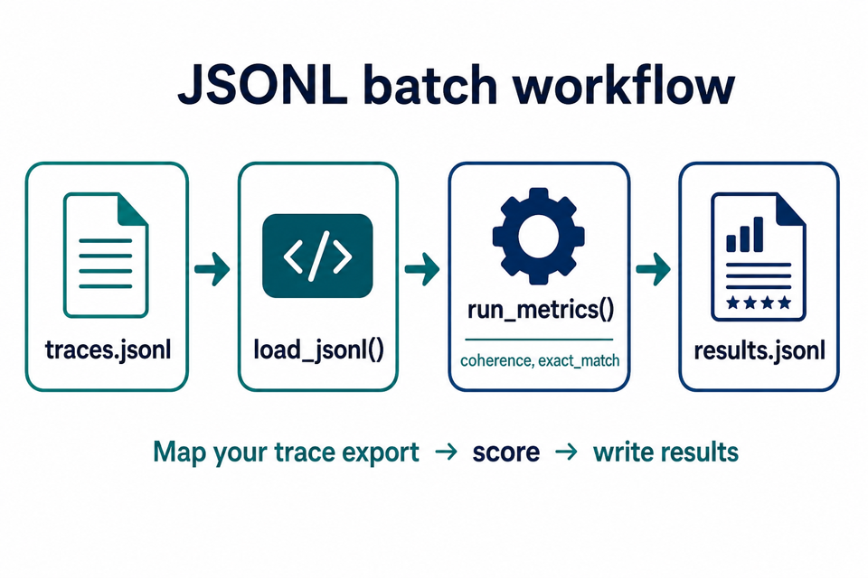
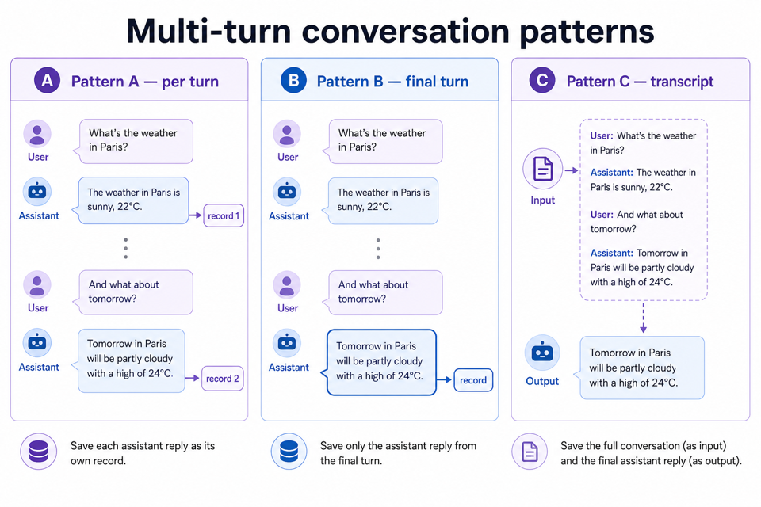

# Batch evaluation and traces

**Version 0.2.0** — Load evaluation rows from **JSONL**, run multiple metrics, and write results — without observability-tool adapters. Map your own trace exports to the canonical record shape.

**See also:** [USAGE.md](USAGE.md) (install, evaluators, CLI) · [CI.md](CI.md) (threshold gates) · [README.md](../README.md) (overview)



---

## 1. Canonical JSONL schema

One JSON object per line. Each row is one **record** passed to evaluators.

```json
{
  "id": "trace-001",
  "input": "user question",
  "output": "model answer",
  "context": "retrieved text",
  "expected": "gold answer",
  "metadata": {"session_id": "s1", "turn": 2}
}
```

| Field | Required | Used by |
|-------|----------|---------|
| `input` | Most LLM metrics | User question or prompt |
| `output` | All metrics | Model / agent reply to judge |
| `context` | RAG metrics | Retrieved chunks, tool output, grounding |
| `expected` | Correctness, code metrics | Reference / gold answer |
| `id` | — | Your trace id (carried through to results) |
| `metadata` | — | Arbitrary tags (`session_id`, `turn`, etc.) |

Evaluators ignore unknown keys. Missing **required** fields for a metric raise `ValueError` with the metric name.

### Minimal examples

Single-turn Q&A:

```json
{"id": "q1", "input": "Capital of France?", "output": "Paris."}
```

RAG row:

```json
{"id": "rag-1", "input": "Refund policy?", "output": "30-day returns.", "context": "All items: 30-day return window."}
```

Code metric row:

```json
{"id": "c1", "output": "42", "expected": "42"}
```

---

## 2. Load and write JSONL

```python
from pathlib import Path

from qapitol.evals import load_jsonl, write_jsonl, write_results_jsonl

records = load_jsonl("traces.jsonl")
write_jsonl("filtered.jsonl", records)

# After scoring (see §4):
write_results_jsonl("results.jsonl", [(record, scores), ...])
```

- **`load_jsonl`** — skips blank lines; UTF-8; one dict per line.
- **`write_jsonl`** — writes one compact JSON object per line.
- **`write_results_jsonl`** — merges each record with its `scores` list (serialized from `Score` objects).

### Result row shape

Each line in `results.jsonl`:

```json
{
  "id": "trace-001",
  "input": "...",
  "output": "...",
  "scores": [
    {"score": 0.9, "name": "coherence", "label": "coherent", "explanation": "...", "kind": "llm", "direction": "maximize", "metadata": {}}
  ]
}
```

---

## 3. Mapping trace exports

There are **no** built-in Langfuse, OpenTelemetry, or LangSmith importers. Export to JSON/CSV from your tool, then map columns:

| Your export field | Map to record field |
|-------------------|---------------------|
| User message / prompt / `question` | `input` |
| Assistant reply / `answer` / completion | `output` |
| Retrieved docs (join with `\n\n`) | `context` |
| Gold label / expected output | `expected` |
| Trace / run / span id | `id` |
| Session, turn, tags | `metadata` |

**Python one-off mapper** (adjust field names):

```python
import json
from pathlib import Path

def export_to_jsonl(rows: list[dict], out: Path) -> None:
    records = [
        {
            "id": r["trace_id"],
            "input": r["user_message"],
            "output": r["assistant_message"],
            "context": r.get("retrieved_context", ""),
            "metadata": {"source": "langfuse"},
        }
        for r in rows
    ]
    out.write_text(
        "\n".join(json.dumps(rec) for rec in records) + "\n",
        encoding="utf-8",
    )
```

For repeatable pipelines, use `load_jsonl` after you save the mapped file.

---

## 4. Run multiple metrics

```python
from qapitol.evals import (
    CoherenceEvaluator,
    ExactMatchEvaluator,
    load_jsonl,
    run_metrics,
    summarize,
    write_results_jsonl,
)
from qapitol.evals.llm import LLM

records = load_jsonl("traces.jsonl")
llm = LLM()
evaluators = [ExactMatchEvaluator(), CoherenceEvaluator(llm)]

results = run_metrics(records, evaluators, concurrency=4)

# Mean score per metric name
by_metric: dict[str, list] = {}
for row in results:
    for s in row["scores"]:
        by_metric.setdefault(s.name, []).append(s)
print(summarize(by_metric))

write_results_jsonl(
    "results.jsonl",
    [(row, row["scores"]) for row in results],
)
```

`run_metrics` runs **each evaluator** over **all records** (batch per metric). Tune `concurrency` for LLM rate limits.

**Cost:** `len(records) × number_of_LLM_evaluators` judge API calls.

---

## 5. Multi-turn conversations



Evaluators take flat `input` / `output` fields — not native `messages[]`. Use a **session** dict with a `messages` list, then helpers in `qapitol.evals.conversation`:

```python
session = {
    "session_id": "s1",
    "messages": [
        {"role": "user", "content": "What is ML?"},
        {"role": "assistant", "content": "Machine learning learns from data."},
        {"role": "user", "content": "Give an example."},
        {"role": "assistant", "content": "Email spam filters use ML."},
    ],
    "context": "",  # optional session-level RAG context
    "metadata": {"product": "demo"},
}
```

Each message: `{"role": "user"|"assistant"|"system", "content": "..."}`.

### Pattern A — One row per turn (`records_per_turn`)

Judge **each** assistant reply separately. Each record gets the **preceding user message** as `input`.

```python
from qapitol.evals.conversation import records_per_turn

records = records_per_turn(session)
# → two records, one per assistant turn
```

Use when every turn must meet quality bars (e.g. agent step checks).

### Pattern B — Final turn only (`record_final_turn`)

Only the **last** assistant message matters.

```python
from qapitol.evals.conversation import record_final_turn

record = record_final_turn(session)
# input = last user message, output = last assistant message
```

Use for goal-completion or final-answer metrics.

### Pattern C — Full transcript in `input` (`format_transcript`)

Prior turns become text in `input`; final reply stays in `output`.

```python
from qapitol.evals.conversation import format_transcript, record_final_turn

base = record_final_turn(session)
record = {
    **base,
    "input": format_transcript(session["messages"][:-1]),
}
```

Optional `max_chars` truncates from the **start** (keeps the most recent context):

```python
format_transcript(messages, max_chars=4000)
```

Long transcripts increase judge tokens and cost.

---

## 6. End-to-end example

Repo: [`examples/04_batch_jsonl.py`](../examples/04_batch_jsonl.py) and [`examples/05_multiturn.py`](../examples/05_multiturn.py).

Sample data: [`examples/data/sample_traces.jsonl`](../examples/data/sample_traces.jsonl).

```bash
pip install -e ".[dev,all]"
python examples/04_batch_jsonl.py
python examples/05_multiturn.py
```

---

## 7. CLI batch (optional)

`qapitol-evals batch --input traces.jsonl --metric coherence --output results.jsonl` may ship in v0.2.1. Until then, use the Python helpers above.

---

## Related

- [README.md](../README.md) — quick starts and illustrations
- [USAGE.md](USAGE.md) — evaluator reference, CLI, FAQ
- [CI.md](CI.md) — mocked CI and threshold snippets
