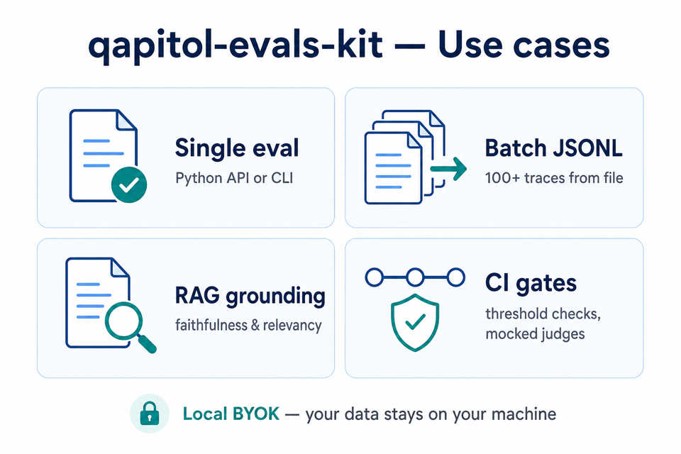

# CI and threshold gates

**Version 0.2.0** — Run evaluation checks in CI **without live LLM costs** by default. Use mocked judges or code-only metrics; reserve live API calls for optional jobs with secrets.

**See also:** [USAGE.md](USAGE.md) · [BATCH_AND_TRACES.md](BATCH_AND_TRACES.md) · [README.md](../README.md)



---

## 1. Recommended CI layout

| Job | When | API keys |
|-----|------|----------|
| `test` | Every push / PR | None — pytest with mocks |
| `eval-gate` | PR or nightly | None — code metrics or `MockCompletionClient` |
| `eval-live` (optional) | Manual / scheduled | `OPENAI_API_KEY` or `ANTHROPIC_API_KEY` |

Install in CI:

```bash
pip install "qapitol-evals-kit[dev,all]==0.2.0"
pytest tests/ -v
```

From source checkout:

```bash
pip install -e ".[dev,all]"
ruff check src tests
pytest tests/ -v
```

---

## 2. Threshold gate (single row)

Fail the job when a score is below your bar:

```python
from qapitol.evals import CoherenceEvaluator
from qapitol.evals.llm import LLM

THRESHOLD = 0.8

score = CoherenceEvaluator(LLM()).evaluate({
    "input": "What is AI?",
    "output": "AI simulates human intelligence.",
})

if not score.passed_threshold(THRESHOLD):
    raise SystemExit(f"FAIL {score.name}: {score.score} < {THRESHOLD}")
```

For **minimize** metrics (e.g. toxicity — higher is safer in this kit), `passed_threshold` still uses `>=` when `direction="maximize"`. Check evaluator docs for direction.

---

## 3. Threshold gate (batch / JSONL)

```python
from qapitol.evals import ExactMatchEvaluator, load_jsonl, run_metrics, summarize

THRESHOLD = 0.9
records = load_jsonl("golden.jsonl")
results = run_metrics(records, [ExactMatchEvaluator()])

by_metric: dict[str, list] = {}
for row in results:
    for s in row["scores"]:
        by_metric.setdefault(s.name, []).append(s)

means = summarize(by_metric)
if means.get("exact_match", 0) < THRESHOLD:
    raise SystemExit(f"FAIL exact_match mean {means['exact_match']} < {THRESHOLD}")
```

Per-row failures:

```python
for row in results:
    for s in row["scores"]:
        if not s.passed_threshold(THRESHOLD):
            rid = row.get("id", "?")
            raise SystemExit(f"FAIL {rid} {s.name}: {s.score}")
```

---

## 4. Mocked judge in CI (no API key)

```python
import json
from qapitol.evals import CoherenceEvaluator
from qapitol.evals.llm import LLM
from qapitol.evals.testing import MockCompletionClient

client = MockCompletionClient({
    "coherent": json.dumps({
        "score": 0.95,
        "label": "coherent",
        "explanation": "fixture",
    }),
})
llm = LLM(provider="openai", model="ci-fixture", client=client)
score = CoherenceEvaluator(llm).evaluate({"input": "Q", "output": "A"})
assert score.passed_threshold(0.8)
```

The project's `tests/` suite uses the same pattern — **no `OPENAI_API_KEY` in default CI**.

---

## 5. Optional live eval job

Gate only when secrets are present:

```yaml
# .github/workflows/eval-live.yml (example sketch)
jobs:
  eval-live:
    if: github.event_name == 'workflow_dispatch'
    runs-on: ubuntu-latest
    steps:
      - uses: actions/checkout@v4
      - uses: actions/setup-python@v5
        with:
          python-version: "3.12"
      - run: pip install "qapitol-evals-kit[all]"
      - run: python scripts/ci_live_eval.py
        env:
          OPENAI_API_KEY: ${{ secrets.OPENAI_API_KEY }}
```

Mark live tests with `@pytest.mark.live` and run only when `QAPITOL_EVALS_LIVE=1` is set.

---

## 6. GitHub Actions snippet (unit tests only)

```yaml
name: ci
on: [push, pull_request]
jobs:
  test:
    runs-on: ubuntu-latest
    steps:
      - uses: actions/checkout@v4
      - uses: actions/setup-python@v5
        with:
          python-version: "3.12"
      - run: pip install -e ".[dev,all]"
      - run: ruff check src tests
      - run: pytest tests/ -v
```

This matches the repo's existing [`.github/workflows/ci.yml`](../.github/workflows/ci.yml).

---

## Related

- [README.md](../README.md) — CI quick start snippet
- [USAGE.md](USAGE.md) §8–9 — testing and thresholds
- [BATCH_AND_TRACES.md](BATCH_AND_TRACES.md) — JSONL batch workflows
